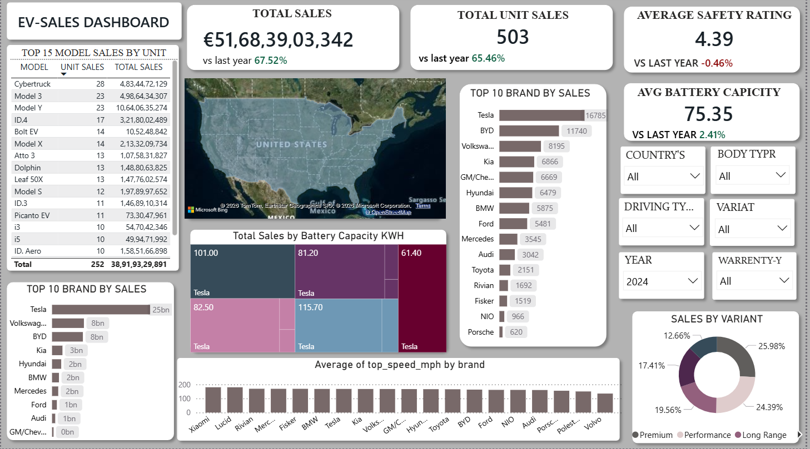

# EV Market Dashboard

## Dashboard Preview

---> Project Overview

This project presents an interactive Power BI dashboard for analyzing Electric Vehicle (EV) market performance. The dashboard provides insights into sales, battery capacity, safety ratings, vehicle variants, and brand performance.

---> Tools Used

> Power BI
> Power Query
> DAX
> Excel / CSV Dataset

---> Key Metrics

> Total Sales
> Total Unit Sales
> Average Safety Rating
> Average Battery Capacity
> Year-over-Year Growth Analysis

---> Dashboard Features

> Interactive Filters
> Brand-wise Sales Analysis
> Battery Capacity Analysis
> Vehicle Variant Distribution
> Geographic Sales Visualization
> Top Performing EV Models

---> Files Included

---> Dashboard

> EV-Sales-Dashboard.pbix

---> Dataset

> ev_market_2026.csv

---> Assets

> Dashboard Screenshot

---> Skills Demonstrated

> Data Cleaning using Power Query
> Data Modeling
> DAX Measures
> Data Visualization
> Dashboard Design
> Business Insights Generation
